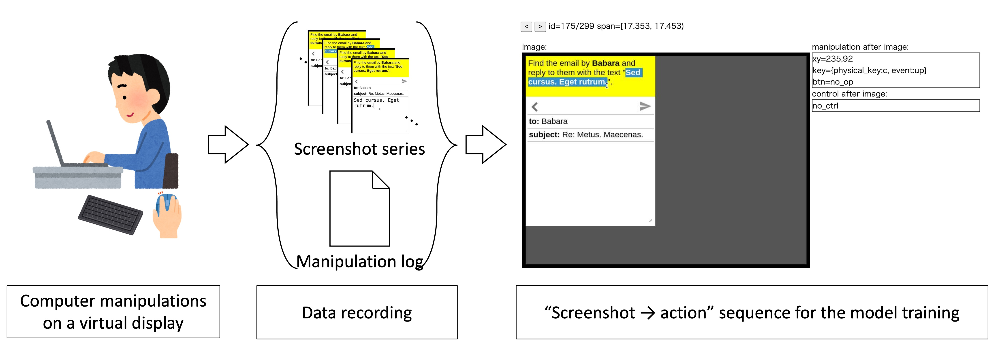
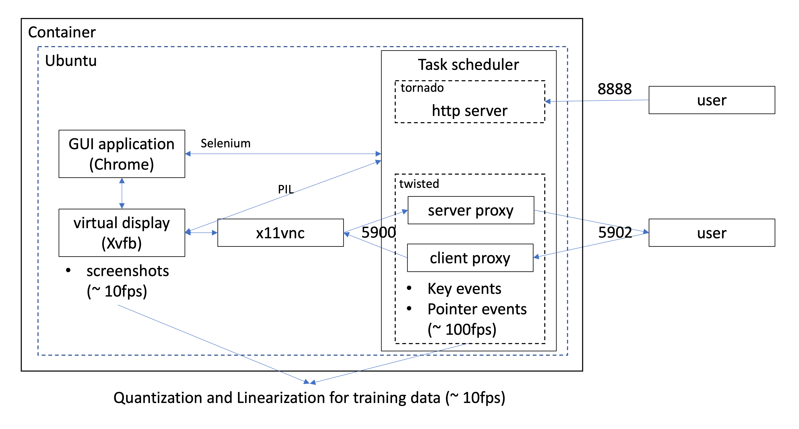

# rec_gui
An Environment for Recording Low-Level Manipulations in Graphical User Interfaces



Structure:



## Prerequisite

- Docker
- Docker-compose (Recommended)
- ARM64 processeres are not supported for the server side currently.

## Usage

We describe the usage of RecGUI running in the local host.

**Note** This software uses non-encrypted vnc and should be used within a trusted private network.

### Recording

#### With Docker-compose

We enter the rec_gui directory and run docker-compose up with variable ID.
Variable ID is required to determine the owner of records. 
This command will run rec-gui and an external task server, nlpb-gui.

```
cd rec_gui
ID="$(id)" docker-compose up --build
```

#### Without Docker-compose

The following commands will run rec-gui only.

```
cd rec_gui
docker build -t rec-gui .
docker run -p 5900:5900 -p 5902:5902 -p 8888:8888 -e ID="$(id)" \
  --mount type=bind,source=$(pwd)/files,target=/files -v /dev/shm:/dev/shm \
  --init --name rec-gui -it rec-gui
```

This case requires network configuration to use external servers.
Create a (Docker) network and run rec-gui and the servers in the same network to access servers by names.

#### Record a GUI manipulation.

Access port 5902 with your VNC Client. We used the VNC viewer provided by RealVNC in our dev environment.

You will be asked to enter a passward. The default password is "vnc" (hard coded in supervisord.conf).
After entering the passward, you will be navigated to the welcome page.
Push the start button to start a task sequence and the recoring.


### Converting

We use the web UI to convert the recorded data (images and manipulation log) into image-action sequences for the model training.

Access the web UI with your browser by entering the url http\://localhost:8888/webui/index .
The page will present some links for the functions of this web UI.

We can see the list of records in the Records page and convert each record by pushing the convert button.

Converted data will be storaged in the files/converted/\<TIMESTAMP\> directory.
The directory includes a series of images and a json file that contains the list of the output actions in every time intervals:

```
+ <TIMESTAMP>
    - meta.json
    - 0.jpg
    - 1.jpg
    ...
```

#### Actions

We adopt six discrete variables to represent an action. 
Each time interval has an action. It shows what action the user took after viewing the screen during that time interval.

| variable | abbreviation | description | dimension |
|:----|:----|:----|:----| 
| pointer x | X | X coordinate of final pointer | ~800 (depending on resolution) |
| pointer y | Y | Y coordinate of final pointer | ~600 (depending on resolution) |
| key event | KE | key events in time interval | 3 (none, down, up) |
| key id | KI | ID of target key | ~100 (more if ID is assigned to a combination) |
| button event | BE | button events that occurred during the time interval | 6 (none, down, up, click, double\_click, triple\_click) |
| butto id | BI | ID of the target button | \< 8 (left, right, wheel up, wheel down, ...) |


### Task sequence file

We specify how to sample tasks with a task sequence file, which is yml formatted.

See [files/tasks/default_tasks.yml](files/tasks/default_tasks.yml) as an example.


## Demonstration

We publish some demonstrations recorded with RecGUI.

- The tasks were sampled from [MiniWoB++](https://stanfordnlp.github.io/miniwob-plusplus/) (excluded flight search tasks, tasks of the delay version, and debug tasks mentioned in the MiniWoB++ website).
- A session lasted 360 seconds, and we recorded 100 sessions with different random seeds.
- The demonstrations were made by one of the RecGUI developers. Thus, they are clean, although thet contain some mistakes.

The following link will take you to the google drive directory, where you will find several zip files. 

[pub_demo](https://drive.google.com/drive/folders/1vigR0KN6StvtRL-u4dzdwUhljBoKUdMp?usp=sharing)

| files | description |
|:---|:---|
| records_n.zip | original data |
| converted_n.zip | converted version |

Each file includes 10 records and the structure of a record is as follows:

```
records_n/miniwob_s*seed*
    - events.txt
    - <timestamp>.jpg
    - ...
```

```
converted_n/miniwob_s*seed*
    - meta.json
    - 0.jpg
    - 1.jpg
    - ...
```
